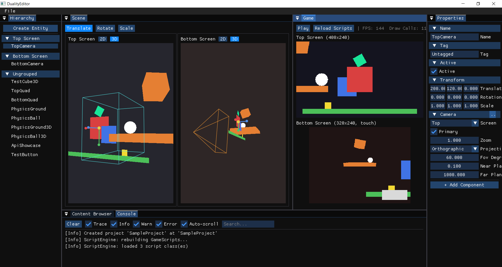
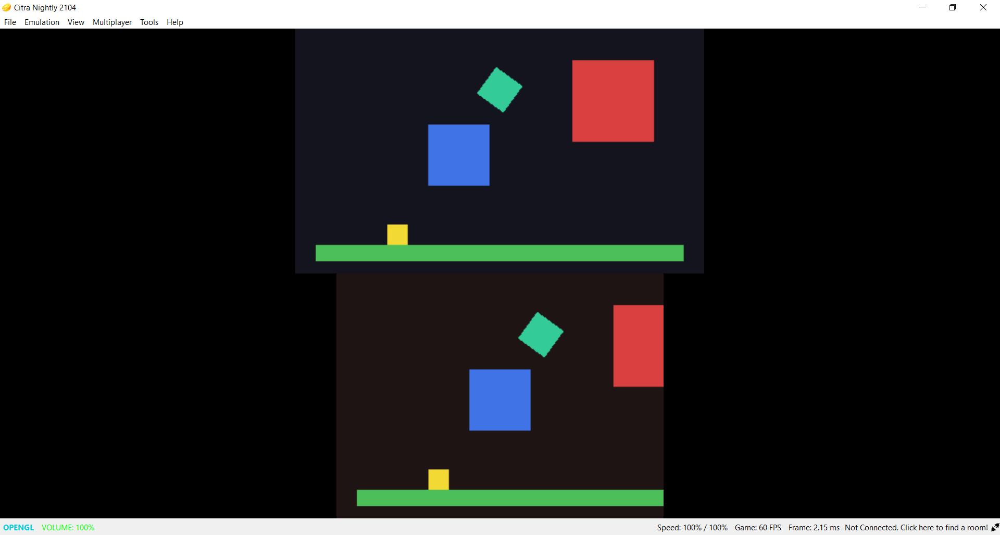

# DualityEngine

A from-scratch C++ game engine + Unity/Cocos-Creator-style drag-and-drop
editor targeting the Nintendo 3DS (devkitARM/devkitPro), developed on
Windows. The same `DualityEngine` core (ECS, reflection, scene
serialization, 2D physics via Box2D, 3D physics via Bullet) compiles for
three targets from one source tree:

- **Desktop** -- `DualityEditor.exe`, the drag-and-drop editor (Dear ImGui).
- **Desktop standalone** -- `DualityPlayerDesktop.exe`, a real GLFW window
  running the same project with no Editor UI at all (an "export to
  Windows" build).
- **3DS** -- `DualityPlayer`, the actual game runtime, built as `.3dsx`
  (Homebrew Launcher / `3dslink`) and `.cia` (installable via FBI on real
  hardware/CFW).

Both 2D (sprites, flipbook animation) and 3D (unlit meshes, OBJ import) render
and physics-simulate side by side on the same screen -- a camera's projection
is just a lens property (Unity's own convention), never a switch between
mutually exclusive pipelines.





New here? `GETTING_STARTED.md` is a hands-on walkthrough (build, tour the Editor,
build a scene, write your first script) -- this file covers architecture, the full
build system, and every feature's details instead. See `ROADMAP.md` for what's
planned but not built yet.

## Prerequisites

1. **devkitPro**, with the 3DS packages installed (`devkitARM`, `citro2d`,
   `citro3d`, `3dstools`, `3ds-cmake`, `general-tools`, etc. -- installed via
   the devkitPro updater/pacman). The `DEVKITPRO` environment variable
   should point at the install (typically `E:\App\devkitPro` or
   `C:\devkitPro`).
2. **A MinGW-w64 toolchain for the desktop build.** devkitPro bundles its
   own MSYS2 install, which does not include this by default -- add it once
   from an MSYS2 shell:
   ```
   pacman -S mingw-w64-x86_64-toolchain mingw-w64-x86_64-glfw \
             mingw-w64-x86_64-glew mingw-w64-x86_64-cmake mingw-w64-x86_64-ninja
   ```
3. **Citra** (or a real 3DS), to run the `.3dsx`/`.cia` output.

If your machine already has another MSYS2/MinGW/Ninja install, make sure it
doesn't shadow devkitPro's on `PATH` -- `build.bat` explicitly prepends
devkitPro's own `msys2\mingw64\bin` to avoid exactly that conflict.

## Desktop: build and run the Editor

```
build.bat               REM configures + builds the Editor, standalone player, and Tests/
run.bat                 REM launches the Editor (sets PATH so glfw3.dll/glew32.dll resolve)
run-desktop-player.bat  REM launches the standalone player (build.bat's DualityPlayerDesktop.exe)
run-tests.bat           REM runs the automated engine-logic test suite (see "Testing" below)
```

`build.bat` re-configures automatically if the build cache looks stale.

### Using the Editor

On launch, the Editor opens (creating if needed) a fixed sample project at
`SampleProject/` next to the executable. There is no "New Project" dialog
yet, but an existing one can be opened via the File menu.

- **File menu** (top) -- **Open Project...** (browse for a `.dproj` file;
  swaps the active project/scene/Content Browser root, stopping Play first
  if it's running), **Save Scene** / **Load Scene** (JSON round-trip to
  `<project>/Assets/Scene.json`), **Save Scene As...** (writes a *snapshot*
  of the current scene to a new file the user picks, without changing which
  scene Save/Load Scene operate on -- this is how a project gets a second
  scene file for `SceneManager`/`Behaviour::LoadScene` to target), and
  **Build for 3DS** (saves the scene, then runs `build-3ds.bat`, see below,
  so the on-device build always packages the latest scene).
- **Hierarchy** (left) -- lists entities in the scene; click one to select
  it. **Create Entity** adds a new empty entity and selects it. A search box
  filters to a flat scene-wide list of matching entities while it has text
  (tree/drag-drop return once it's cleared). Right-click an entity for
  **Create Child Entity** or **Create Prefab from Selection** (writes
  `Assets/Prefabs/<Name>.prefab.json`); drag a Prefab asset from the Content
  Browser onto empty space in this panel to instantiate it.
- **Properties** (right) -- shows every component on the selected entity,
  fields fully generic (reflection-driven -- adding a new component/field
  never needs editor code changes). Every entity has an **Active** checkbox
  (Unity's `GameObject.SetActive`) alongside Transform/Name/Tag. Each
  non-mandatory component has a "..." button to remove it; **+ Add
  Component** at the bottom lists every component type not already on the
  entity.
- **Scene** (center, tabbed with Game) -- one free-roam edit camera per
  screen, independent of any in-scene camera, with a **2D | 3D** toggle per
  pane. 2D: middle-drag to pan, wheel to zoom, left-click a sprite to select
  it. 3D: left-click/drag to select and gizmo-drag, right-drag to orbit
  (a genuine quaternion orbit -- no gimbal-lock clamp, it flips smoothly
  through the poles like Unity/Blender), middle-drag to pan, wheel to zoom.
  The viewport always exactly fills the panel. Camera entities draw a real
  frustum wireframe (near/far planes, FOV) instead of a flat marker, so you
  can see exactly where a camera is looking. **Translate / Rotate / Scale**
  buttons switch the selected entity's gizmo mode -- drag a handle to edit
  its Transform live, visible immediately in Scene, Game, and on a real 3DS
  build. `Transform.Rotation` is always in degrees. Colliders
  (`BoxCollider2D`/`CircleCollider2D`/`BoxCollider3D`/`SphereCollider3D`)
  draw as green wireframe outlines for every entity that has one -- an
  editor-only visualization, like Unity's Gizmos, never actually rendered
  in the Game view or on-device.
- **Game** (center, tabbed with Scene) -- exactly what the real
  TopCamera/BottomCamera entities render, stacked to match the console's
  physical layout (Top 400x240 above, Bottom 320x240 below). This is the
  same render pass the 3DS build itself uses. **Play / Stop** runs the full
  runtime lifecycle (`Behaviour` scripts, 2D/3D physics, collision/trigger
  events, UI) against the live scene; **Reload Scripts** rebuilds
  `GameScripts` and hot-reloads it into the running Editor without
  restarting -- edit a script's `.cpp`, click this, see the change
  immediately.
- **Console** (bottom, tabbed with Content Browser) -- `Duality::Log`
  output (including `Behaviour::LogInfo/LogWarn/LogError` calls from
  scripts), color-coded and filterable by level (Trace/Info/Warn/Error),
  plus a text search box and a Clear button.
- **Content Browser** (bottom, tabbed with Console) -- browses
  `SampleProject/Assets/` as a grid of icons, with real thumbnails for image
  files, and a search box that filters files by name within the current
  folder (folders themselves stay visible so navigation keeps working).
  Every asset gets a companion `<name>.meta` file (a stable GUID,
  Unity/Unreal-style) generated the first time the Content Browser sees it;
  `.meta` files themselves are hidden from the grid. Drag an asset out onto
  an `AssetRef` field in Properties (a texture, a Material, a Prefab, ...)
  to assign it (referenced by its GUID, so renaming/moving the file later
  doesn't break it); drag a file in from Windows Explorer to import it into
  whatever folder is currently open.

### Writing gameplay scripts

Scripts live in `GameScripts/` -- built as a hot-reloadable DLL for desktop
Play-in-Editor, or linked statically straight into `DualityPlayer` for the
3DS build (same source files, no code changes either way). To add one:

1. Add a class deriving from `Duality::Behaviour` (see
   `GameScripts/Include/BounceBehaviour.h`/`Source/BounceBehaviour.cpp` for
   the pattern), overriding whichever lifecycle methods it needs (see below).
2. Register it with `REGISTER_BEHAVIOUR(YourClassName)` at the bottom of its
   `.cpp` file.
3. Add the new source file to `GameScripts/CMakeLists.txt`.
4. In the Editor, set an entity's `BehaviourComponent` "Class" field to the
   class name (a plain string, matched by name -- like picking a
   MonoBehaviour in Unity), then click **Reload Scripts**.

### Lifecycle

- `OnCreate()` -- once, when Play starts (Unity's `Awake`, runs even if the
  entity starts inactive).
- `OnEnable()` / `OnDisable()` -- fire whenever `Scene::IsEffectivelyActive`
  flips for this entity (its own `SetActive` call, or a parent's) -- can
  fire many times across one Play session. `OnUpdate` simply isn't called
  while inactive.
- `OnUpdate(float deltaTime)` -- every frame, while active.
- `OnCollisionEnter(Entity other)` / `OnCollisionExit(Entity other)` --
  fires for BOTH sides of a touching pair (Unity's own convention) when
  neither collider involved is a trigger. Works identically whether `other`
  is a 2D or 3D entity.
- `OnTriggerEnter(Entity other)` / `OnTriggerExit(Entity other)` -- same as
  above, but for a pair where at least one collider has `IsTrigger` set.
- `OnDestroy()` -- once, at Stop (a still-enabled instance gets one final
  `OnDisable()` immediately before this).

### Scripting API

Inside any lifecycle method, a script can call (all inherited from
`Behaviour`):

- **Active state**: `SetActive(bool)` / `IsActive()` -- Unity's
  `GameObject.SetActive`/`activeSelf`. Toggling this does NOT dynamically
  add/remove a Rigidbody's physics body mid-Play -- only whether one
  existed when Play started.
- **Input**, Unity-old-Input-Manager-style: `GetKey`/`GetKeyDown`/
  `GetKeyUp(Duality::KeyCode::...)`, `GetAxis("Horizontal")`/
  `GetAxis("Vertical")` (digital ±1 from WASD/arrows on desktop, real analog
  values from the Circle Pad on 3DS -- same script code, platform-
  appropriate values on each), and `GetPointerDown()`/`GetPointerPosition()`
  (mouse on desktop, touchscreen on 3DS). `KeyCode` covers common desktop
  keys (`W`/`A`/`S`/`D`, arrows, `Space`/`Enter`/`Escape`) and 3DS buttons
  (`GamepadA`/`B`/`X`/`Y`/`L`/`R`, `GamepadStart`/`Select`, D-Pad) -- a
  keycode meaningless on the current platform just always reads as not
  pressed, rather than being unavailable.
- **Audio**: `PlaySound(assetGuid, loop=false)` / `StopAllSounds()` play a
  WAV asset (referenced by its `.meta` GUID, same as a
  `SpriteRendererComponent::Texture` field) through the same real audio
  backend the engine itself uses (miniaudio on desktop, `ndsp` on 3DS --
  only 16-bit PCM WAV is supported on-device, since there's no vendored
  decoder for real hardware).
- **Logging**: `LogInfo`/`LogWarn`/`LogError(message)` -- shows up in the
  Editor's Console panel exactly like every other engine log line.
- **Cross-screen lookup**: `FindEntityInTopScreen`/`FindEntityInBottomScreen
  (name)` -- finds an entity by name under a screen's `ScreenGroupComponent`
  subtree (falls back to a scene-wide by-name search if that screen has no
  tagged group yet).
- **Scene transitions**: `LoadScene(assetsRelativePath)` (e.g.
  `"Scenes/Level2.json"`, a file created via the Editor's **Save Scene
  As...**) -- Unity's `SceneManager.LoadScene`. Deferred: the swap actually
  happens between frames, not synchronously when this returns, since a
  script can't safely tear down the very Scene its own call stack is
  running inside of.
- **Prefabs**: `Instantiate(prefabAssetGuid) -> Entity` -- Unity's
  `Object.Instantiate`, spawns a copy of a `.prefab.json` asset (see
  "Create Prefab from Selection" above) as a new root entity in this
  script's own Scene.

Two more APIs don't need `Behaviour` at all, since they're header-only with
no engine state to synchronize across the DLL boundary:
`Duality::SaveSystem::SaveJson`/`LoadJson(path)` (plain JSON file save/load,
path resolved against the process's working directory on both platforms)
and `Duality::DateTime::Now()` (the real system clock, identical on both
platforms).

`GameScripts/Source/ApiShowcaseBehaviour.cpp` exercises the Input/Audio/
Save/DateTime APIs in one script, attached to the "ApiShowcase" entity in
the sample scene -- move it with WASD/the Circle Pad, hold the pointer to
pull it toward the cursor/touch, press Space/A for a beep, and watch it
spin once a minute, driven by the real clock.
`GameScripts/Source/CollisionLogBehaviour.cpp` is the equivalent living
example for the collision/trigger lifecycle -- attach it to any entity with
a Rigidbody + collider and watch the Console panel as it touches things.

## 3DS: build and run on-device

```
build-3ds.bat   REM clean configure+build -> build-3ds\DualityPlayer\DualityPlayer.3dsx / .cia
run-3ds.bat     REM launches the .3dsx in Citra
```

`build-3ds.bat` always starts from a clean `build-3ds\` directory (the
devkitPro CMake+Make combination has a reproducible bug where reconfiguring
in place after a `CMakeLists.txt` change corrupts a generated dependency
file -- a full rebuild avoids it and only takes well under a minute).

- `.3dsx` is for the fast iteration loop: Homebrew Launcher, or
  `3dslink -s build-3ds\DualityPlayer\DualityPlayer.3dsx` to push it to a
  real 3DS/Citra over network.
- `.cia` is for installing via FBI on real hardware/CFW. Building it needs
  `makerom.exe`/`bannertool.exe`, fetched once from their official GitHub
  releases into `Tools/` (see `Tools/` below) -- if they're missing, the
  build still succeeds and just skips `.cia`.

`DualityPlayer` loads whatever scene was last packaged into
`DualityPlayer/romfs/Scene.json` (copied there automatically by the
Editor's "Build for 3DS" button, or by `build-3ds.bat` if you've placed one
there yourself). `Behaviour` scripts, 2D physics (Box2D), and 3D physics
(Bullet) all run for real on-device -- `GameScripts` links `STATIC` into
`DualityPlayer` (vs. the hot-reload `SHARED` DLL used for desktop
Play-in-Editor), the exact same script source files either way. There's no
Play/Stop on a real device: the simulation runs continuously from launch
until START is pressed. `Behaviour::LoadScene`-driven scene transitions
work on-device too, as long as the target scene file lives under the
project's `Assets/` folder (it gets cooked into romfs the same way any
other non-`.png` asset does -- see `BuildPipeline::CookAssets`).

Bullet Physics' real-world ARM11 performance/stability hasn't been
independently verified beyond this project's own testing -- devkitPro
ships `3ds-bulletphysics` as an official portlib, but with no worked
example and no known shipped 3DS game using it.

## Testing

```
run-tests.bat   REM runs Tests/DualityEngineTests.exe (build.bat builds it automatically)
```

`Tests/` is a small, permanent, desktop-only test suite for engine-level
logic -- ECS/Active-Disable lifecycle, 2D/3D collision and trigger events,
Bullet physics (gravity/landing/rotation), `SceneManager`'s request
mailbox, and Prefab save/instantiate round-tripping -- linking directly
against `DualityEngine`'s real compiled code, no mocks. Uses a small
hand-rolled `TEST_CASE`/`CHECK` harness (`Tests/TestFramework.h`) instead
of vendoring Catch2/GoogleTest, matching this project's general preference
for small dependency-free infrastructure over a new library. `.github/
workflows/ci.yml` runs `build.bat` + `run-tests.bat` on every push/PR
(desktop only for now -- the 3DS cross-compile isn't wired into CI yet).

## Repository layout

```
DualityEngine/       Shared engine core (ECS, reflection, scene, renderer
                     interface + OpenGL/citro2d/citro3d backends, 2D physics
                     via Box2D, 3D physics via Bullet, scripting registry)
DualityEditor/       Desktop editor (Dear ImGui) -- Application owns a Window
                     (GLFW/GL/ImGui backend) and every Panel (Scene, Game,
                     Hierarchy, Properties, MenuBar, Content Browser,
                     Console); Main.cpp is just Application().Run()
DualityPlayerDesktop/ Standalone desktop player (real GLFW window, no Editor UI)
DualityPlayer/       3DS runtime executable + Packaging/ (icon/banner/RSF for .cia)
GameScripts/         Gameplay scripts, built as a hot-reload DLL (desktop) or
                     linked statically (3DS)
Tests/               Automated engine-logic test suite (see "Testing" above)
Vendor/              Third-party dependencies (vendored as source, see below)
Tools/               makerom.exe / bannertool.exe (fetched from their own
                     releases -- see "3DS: build and run on-device" above)
SampleProject/       The Editor's one (for now) project: Assets/, Scene.json
References/          Prior-art repos consulted during development (not built)
.github/workflows/   CI (desktop build + automated tests on every push/PR)
```

Third-party dependencies in `Vendor/` (EnTT, GLM, nlohmann/json, ImGui,
stb_image, miniaudio, Box2D, Bullet Physics) are vendored as plain source
files rather than fetched via CMake `FetchContent`, for fast, offline,
reproducible builds. GLFW/GLEW instead come from the mingw-w64 package
repo (prebuilt binaries).

## Known limitations

- No "New Project" flow yet, and no Project Hub / recent-projects list --
  Open Project is a plain file-browse dialog for now.
- `Entity` handles held across a "Load Scene"/"Open Project" click (e.g. the
  current selection) can go stale, since either replaces the whole registry
  -- `SceneManager.LoadScene` handles this correctly for itself (resets
  `ctx.Selected`), but a script holding an `Entity` from before a scene
  swap does not get any such reset.
- No collision-event Stay variant (`OnCollisionEnter`/`Exit` and
  `OnTriggerEnter`/`Exit` exist; no per-frame-while-touching `OnCollisionStay`/
  `OnTriggerStay` yet), no Raycast API, and no physics joints/constraints
  (hinge, spring, fixed) for either Box2D or Bullet.
- A Prefab instance has no link back to its source asset -- editing the
  original `.prefab.json` later does not update entities already
  instantiated from it (no "Apply"/"Revert" like Unity's prefab instances).
- No `ScriptableObject`-equivalent (a reusable, Inspector-editable data
  asset not tied to any entity) -- would need its own non-Entity-coupled
  reflection registry alongside `TypeRegistry`, which is fundamentally
  Entity-coupled today.
- `TransformComponent::Scale` isn't read by 2D sprite rendering (3D mesh
  rendering does use it as the mesh's own world-space size).
- The in-game UI system covers Panel/Image and Button widgets only -- no
  text/label widget yet (needs real font rendering, not built on desktop),
  no 9-slice/border scaling, and no visual drag-and-drop UI builder.
- No 3D lighting/material system yet (meshes are unlit; `Material` is
  currently just Color + Texture) and no skeletal/mesh animation for
  imported OBJ meshes.

See `ROADMAP.md` at the repo root for the fuller list of planned/deferred
work (kept up to date independently of this section).
